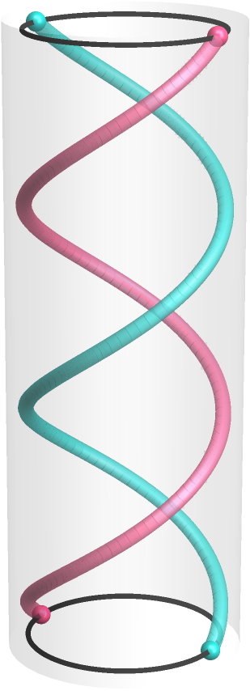
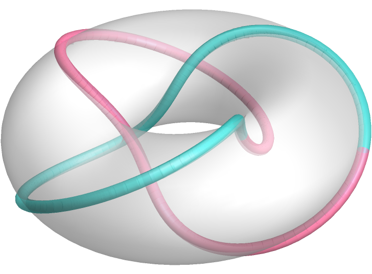
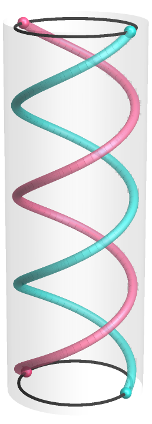
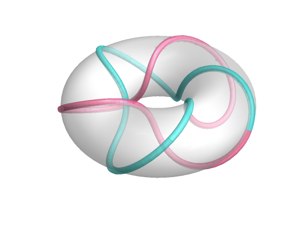
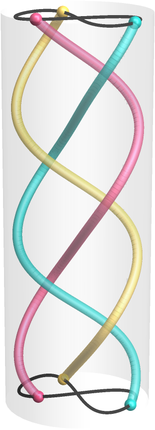
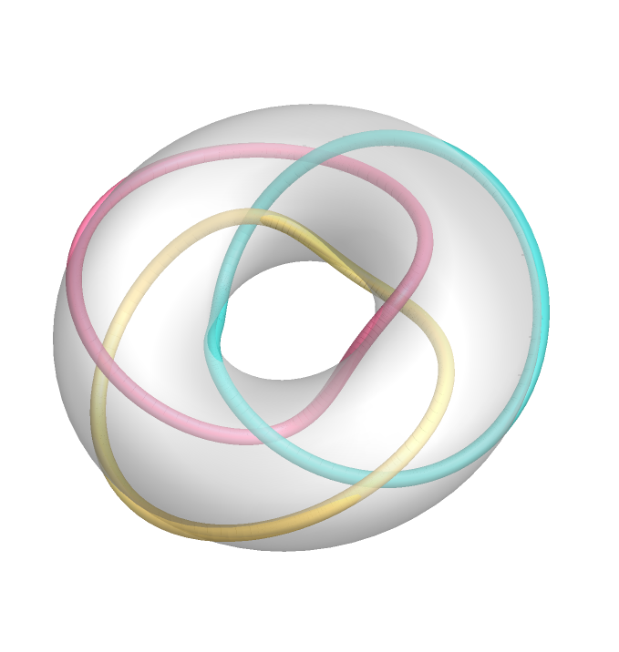
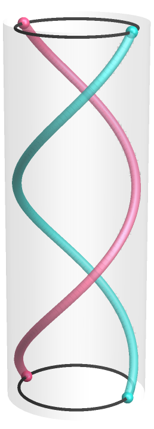
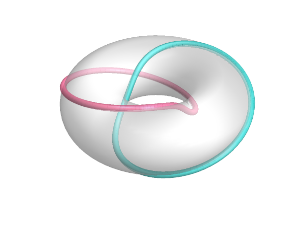
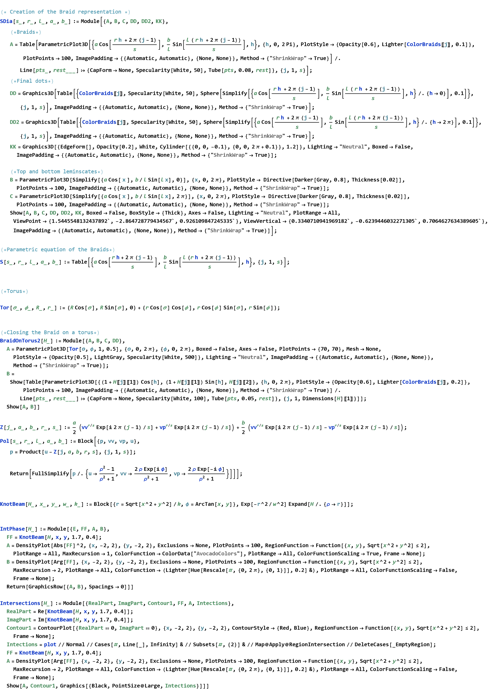

# Calculation of the Field for creating Singular Knotted Skeletons using Structured Light 

### Basic definitions 

**Knot** - It is a closed, non-self-intersecting curve embedded in three dimensions.  

**Braid** -  ****A braid in n strands is defined as a set of *n* non-intersecting smooth lines joining two parallel planes.
 
Alexander's Theorem: *"Every oriented knot or link can be represented by a closed braid "*

### Lemniscate Knots  

This notebook stands as an implementation of the work by Bode et al. [1] on the properties of the lemniscate knots. 

In the transverse plane to the braids height, the *s* strands trace a lemniscate curve - a $(1,\ell )$ Lissajous Curve parametrized by $h\in [0,2\pi ]$. Therefore, we can write the parametric curve for the *j*-th strand as

$\text{                                                                                                                                       }S_j{}^{s,r,\ell }(h;a,b)= \left( a \text{Cos}\left[\frac{1}{s}\{\text{rh}+2\pi (j-1)\}\right],\frac{b}{\ell }\text{Sin}\left[\frac{\ell }{s}\{\text{rh}+2\pi (j-1)\}\right], h \right)$

where $a,b\in \mathbb{R}$are stretching factors.  The closure of the braid is parametrized as 

													    $\left( \text{Cos}[h]\left\{ R+a \text{Cos}\left[\frac{1}{s}\{\text{rh}+2\pi (j-1)\}\right]\right\}, \text{Sin}[h]\left\{ R+a \text{Cos}\left[\frac{1}{s}\{\text{rh}+2\pi (j-1)\}\right]\right\},\left\{\frac{b}{\ell }\text{Sin}\left[\frac{\ell }{s}\{\text{rh}+2\pi (j-1)\}\right]\right\} \right)$


```wl
In[]:= GraphicsGrid[{{SDia[2, 3, 1, 1, 1], BraidOnTorus2[S[2, 3, 1, 0.5, 0.5]]}, {SDia[3, 3, 2, 1, 1], BraidOnTorus2[S[3, 3, 2, 0.5, 0.5]]}}, Spacings -> 50]
```

The braid can represented by the family of complex polynomials  $p_h{}^{s, r, \ell }(u)$with $u\in \mathbb{C}$, that have roots $Z_j{}^{s,r,\ell }(h)$ given in the intersection of the parametrized braid with the horizontal plan so

																			$p_h{}^{s,r,\ell }(u)=\prod _{j=1}^{ s}  \left[ u-Z_j{}^{s,r,\ell }(h) \right]$

where we had parametrized $Z_j{}^{s,r,\ell }(h)= a \text{Cos}\left[\frac{1}{s}\{\text{rh}+2\pi (j-1)\}\right]+ i\frac{b}{\ell }\text{Sin}\left[\frac{\ell }{s}\{\text{rh}+2\pi (j-1)\}\right]$. The semiholomorphic map $f\left(u,v,\bar{v}\right)$ with knotted zero line is fond by the replacements, in $p_h{}^{s,r,\ell }(u)$, $\exp (i h)\text{-$>$}v$ and $\exp (-i h)\text{-$>$}\bar{v}$ . The mapping to the complex plane can be obtained by considering the substitutions 
																		$u\text{-$>$}\frac{\rho ^2-1}{\rho ^2+1},\text{          }v\text{-$>$}\frac{2 \rho \text{  }\exp [\text{i$\phi $}]}{\rho ^2+1},\text{          }\bar{v}\text{-$>$}\frac{2 \rho \text{  }\exp [-\text{i$\phi $}]}{\rho ^2+1}$

From here, we can obtained the complex polynomial in the complex plane from the numerator of $p_h{}^{s,r,\ell }\left(u,v,\bar{v}\right)\text{-$>$}p_h{}^{s,r,\ell }(\rho ,\phi )$.

```wl
In[]:= Expand[Numerator[Pol[2, 3, 1, 1, 1]]](*Trefoil*)
```

```wl
Out[]= 1 - \[Rho]^2 - 8 E^(3 I \[Phi]) \[Rho]^3 - \[Rho]^4 + \[Rho]^6
```

The knotted field can be constructed as the product of the later polynomial and a Gaussian envelope

																			$\pmb{E}(\pmb{r})=\text{Exp}\left[-\frac{r^2}{w_0{}^2}\right] \text{Numerator}\left[p_h{}^{s,r,\ell }(r,\phi )\right]$       

```wl
In[]:= IntPhase[Expand[Numerator[Pol[2, 3, 1, 1, 1]]]]
```

The evolution of the electric field as it propagates can be obtained by means of the Fresnel Propagator [2, 3].  (Still has to be implemented properly)


The singular points of the field at any plane $z$ can be obtained by calculating the intersections of the curves when $\text{Re}[ \pmb{E}(\pmb{r}) ]=\text{Im}[ \pmb{E}(\pmb{r}) ]=0$

```wl
In[]:= Intersections[Expand[Numerator[Pol[2, 3, 1, 1, 1]]]]
```

```wl
In[]:= 
```

```wl
Out[]= $Aborted
```

```wl
In[]:= 
```

```wl
In[]:= 
```

### Examples 

#### Trefoil knot 

```wl
In[]:= Show[SDia[2, 3, 1, 1, 1], PlotRange -> All ]
```



```wl
In[]:= BraidOnTorus2[S[2, 3, 1, 0.5, 0.5]]
```



```wl
In[]:= Expand[Numerator[Pol[2, 3, 1, 1, 1]]](*Trefoil*)
```

```wl
Out[]= 1 - \[Rho]^2 - 8 E^(3 I \[Phi]) \[Rho]^3 - \[Rho]^4 + \[Rho]^6
```

#### Cinquefoil

```wl
In[]:= Show[SDia[2, 4, 1, 1, 1], PlotRange -> All ]
```



```wl
In[]:= BraidOnTorus2[S[2, 5, 1, 0.5, 0.5]]
```



```wl
In[]:= Expand[Numerator[Pol[2, 5, 1, 1, 1]]](*Cinquefoil*)
```

```wl
Out[]= 1 + \[Rho]^2 - 2 \[Rho]^4 - 32 E^(5 I \[Phi]) \[Rho]^5 - 2 \[Rho]^6 + \[Rho]^8 + \[Rho]^10
```

#### Borromean rings

```wl
In[]:= Show[SDia[3, 3, 2, 1, 1], PlotRange -> All ]
```



```wl
In[]:= 
```

```wl
In[]:= BraidOnTorus2[S[3, 3, 2, 0.5, 0.5]]
```



```wl
In[]:= Expand[Numerator[Pol[3, 3, 2, a, b]]](*borromean*)
```

```wl
Out[]= -1 + 3 \[Rho]^2 - 3 \[Rho]^4 + \[Rho]^6 - 8 a^3 \[Rho]^3 Cos[\[Phi]]^3 - 24 I a^2 b \[Rho]^3 Cos[\[Phi]]^2 Sin[\[Phi]] + 24 a b^2 \[Rho]^3 Cos[\[Phi]] Sin[\[Phi]]^2 + 8 I b^3 \[Rho]^3 Sin[\[Phi]]^3
```

```wl
In[]:= FullSimplify[-1 + 3 \[Rho]^2 - 3 \[Rho]^4 + \[Rho]^6 - 8 a^3 \[Rho]^3 Cos[\[Phi]]^3 - 24 I a^2 b \[Rho]^3 Cos[\[Phi]]^2 Sin[\[Phi]] + 24 a b^2 \[Rho]^3 Cos[\[Phi]] Sin[\[Phi]]^2 + 8 I b^3 \[Rho]^3 Sin[\[Phi]]^3]
```

```wl
Out[]= (-1 + \[Rho]^2)^3 - 8 \[Rho]^3 (a Cos[\[Phi]] + I b Sin[\[Phi]])^3
```

```wl
In[]:= 
```

```wl
In[]:= FullSimplify[Expand[% /. {b -> a}]]
```

```wl
Out[]= -8 a^3 E^(3 I \[Phi]) \[Rho]^3 + (-1 + \[Rho]^2)^3
```

#### Hopf Link

```wl
In[]:= Show[SDia[2, 2, 1, 1, 1], PlotRange -> All ]
```



```wl
In[]:= BraidOnTorus2[S[2, 2, 1, 0.5, 0.5]]
```



```wl
In[]:= Expand[Numerator[Pol[2, 2, 1, 1, 1]]](*Hopf Link *)
```

```wl
Out[]= 1 - 2 \[Rho]^2 - 4 E^(2 I \[Phi]) \[Rho]^2 + \[Rho]^4
```

```wl
In[]:= Expand[Numerator[Pol[2, 2, 1, a, b]]]
```

```wl
Out[]= 1 - 2 \[Rho]^2 - 2 a^2 \[Rho]^2 + 2 b^2 \[Rho]^2 + \[Rho]^4 - 2 a^2 \[Rho]^2 Cos[2 \[Phi]] - 2 b^2 \[Rho]^2 Cos[2 \[Phi]] - 4 I a b \[Rho]^2 Sin[2 \[Phi]]
```

```wl
In[]:= FullSimplify[1 - 2 \[Rho]^2 - 2 a^2 \[Rho]^2 + 2 b^2 \[Rho]^2 + \[Rho]^4 - 2 a^2 \[Rho]^2 Cos[2 \[Phi]] - 2 b^2 \[Rho]^2 Cos[2 \[Phi]] - 4 I a b \[Rho]^2 Sin[2 \[Phi]]]
```

```wl
Out[]= 1 - 2 (1 + a^2 - b^2) \[Rho]^2 + \[Rho]^4 - 2 (a^2 + b^2) \[Rho]^2 Cos[2 \[Phi]] - 4 I a b \[Rho]^2 Sin[2 \[Phi]]
```

### References

1.  Bode, Benjamin, Mark R. Dennis, David Foster, and Robert P. King. *"Knotted fields and explicit fibrations for lemniscate knots."* Proceedings of the Royal Society A: Mathematical, Physical and Engineering Sciences 473, no. 2202 (2017): 20160829.

1. Goodman, Joseph W.. *Introduction to Fourier optics.* United States: W. H. Freeman, 2005.

1. Breckinridge, J., D. Voelz, and J. B. Breckinridge. *"Computational Fourier Optics: A MATLAB Tutorial."* (2011).


### Functions 

#### Preamble

```wl
In[]:= SetDirectory@NotebookDirectory[]; 
  (*Creates a list of n colors*)
 Colors[n_] := With[{partL = Ceiling[Sqrt[n]]}, DeleteCases[Flatten[Transpose[Partition[Table[Lighter[Darker[Hue[c], .1], .25], {c, 0, 1 - 1/n, 1/n}], partL, partL, 1, 0]]], 0]] 
   
  (*Extra nice Custom colors*)
 FunkyT = RGBColor[188/255, 224/255, 225/255];
 Pantone2459 = RGBColor[1/255, 181/255, 174/255];
 Pantone218 = RGBColor[206/255, 102/255, 161/255];
 Pantone199 = RGBColor[227/255, 56/255, 109/255];
 Pantone149 = RGBColor[243/255, 194/255, 66/255];
 PantoneProceBlue = RGBColor[63/255, 143/255, 205/255];
 Pantone7664 = RGBColor[104/255, 48/255, 120/255]; 
   
  (*Colouring the braids*)
 ColorBraids = {Pantone2459, Pantone199, Pantone149, PantoneProceBlue, Pantone7664};
```

#### Lemniscate Knots calculations


